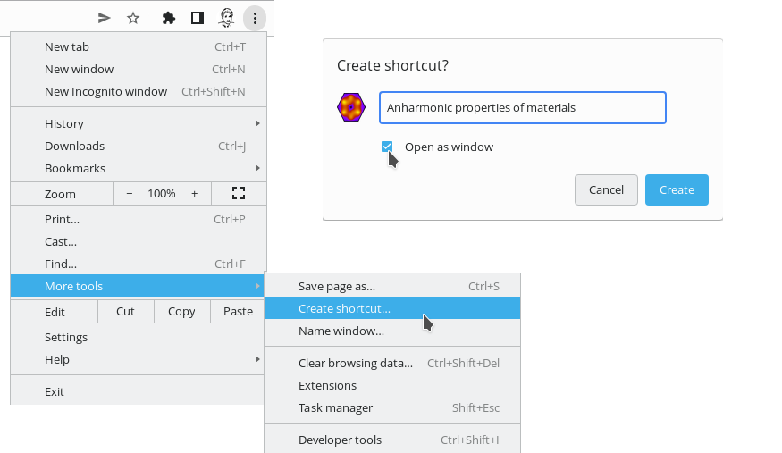

Electron based minimal kiosk browser made for a Linux-based tv-box. Each app will:
* show a single web site
* in fullscreen mode

Depending on the website in question, additional requirements can be necessary to work properly:
* support DRM (Netflix, Disney+)
* allow a Google login (Stadia, Youtube, Youtube Music)
* guarantee some additional privacy (Youtube, Youtube Music, Spotify)
* open external links in a real browser window (GeForce NOW, could become necessary for Google apps)

Different methods used:
*  Support DRM by using [Castlab electron release that includes widevine](https://github.com/castlabs/electron-releases/releases) (I did not manage to include the widevine plugin for chrome using widely published methods available on the web)
* Allow Google login by spoofing the global user agent (it is working for the moment, but may fail in the future and requuire much more complicated work-arounds)
* Improve privacy with @cliqz/adblocker-electron content blocker

Only tested on Linux, patches for MacOSX and Windows are accepted but cannot be tested by me.

Building each package is slightly different, depending on the modules that are included, please refer to the README.md file in each subdirectory for additional details. In genenral they were tested with the current LTS version of electron (16.x.x), either from [nvm](https://github.com/nvm-sh/nvm#installing-and-updating) or from Castlab.

This software is provided mostly for educational purpose. Website logos are not provided to avoid copyright claims, but can be retrieved i.e. using google-chrome select Tools--&gt;More tools-&gt;Save shortcut, check "Open as Window". The icon will be saved under $HOME/.local/share/icons/hicolor/256x256/apps/chrome-XXXXXX.png

